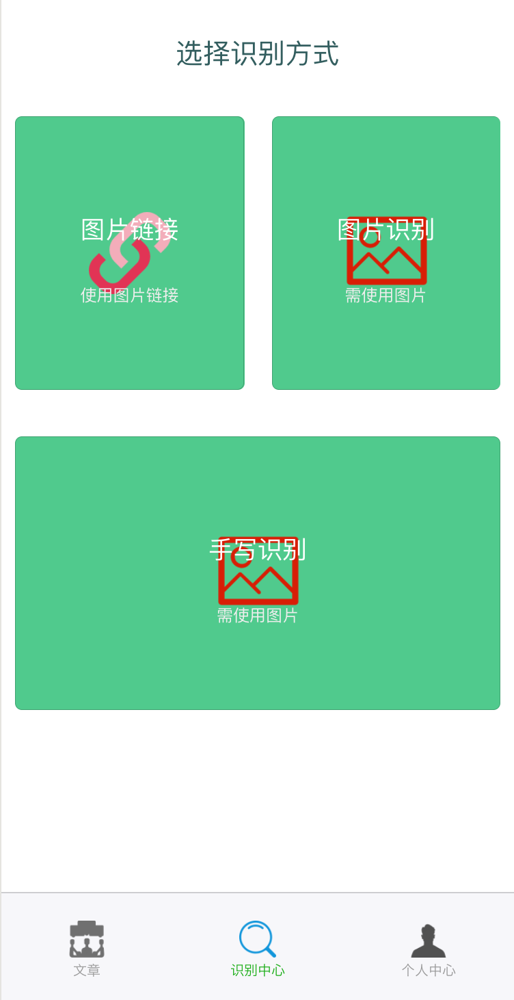

## 需要预先安装[wepy](https://github.com/Tencent/wepy)

```
npm install wepy-cli -g
```

## 下载对应的包

```
npm install
```

## 启动

```
wepy build --watch
```

 ## 效果


文章列表页


### 文章详情页


### 识别方式选择




### 个人中心


### 图片链接识别


### 图片识别结果


### 手写单字识别


